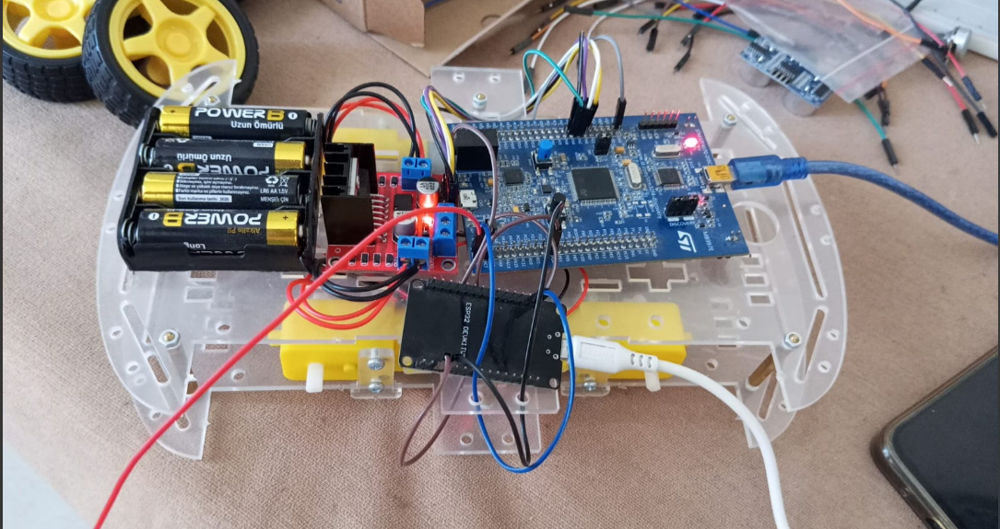

# RobotCar-MQTT — STM32 ↔ ESP32 (Komut Köprüsü)

## 1) Sistem Açıklaması & Yazılım Mimarisi
Bu proje **komut-temelli** bir köprü kurar: **ESP32**, MQTT’den aldığı **sayısal** değerleri (`"1"`, `"2"`, `"3"` …) **UART1 (115200-8N1, `\n`)** ile **STM32**’ye gönderir; **STM32** bu değeri motor fonksiyonuna çevirip motoru sürer.  

**ESP32 (ESP-IDF) tarafı (yazılım)**
- `wifi_connect.[ch]` → Wi-Fi STA bağlan/yeniden bağlan (SSID/PASS NVS)
- `app_mqtt.[ch]` → MQTT istemcisi (LWT; subscribe/publish API)
- `uart.[ch]` → UART1’e satır-sonlu (`\n`) yazım
- `app_main.c` → görevlerin başlatılması
- Aktif görevler: `wifi_task`, `mqtt_task`, **`uart_tx_task`**  
 

**STM32 tarafı (yazılım)**
- `main.c` / `motor_control.c` sayısal komutu yorumlar; **ileri/geri/sol/sağ/dur** gibi fonksiyonları çağırır.
- Komut eşlemesi projeye göre: `1`→İleri, `2`→Geri, `3`→Sol, `4`→Sağ, `5`→Dur (örnek)

---

## 2) Sistem Genel Bakış & Adafruit IO

**Adafruit IO Pano**
- **Feed:** `robotcar.commands`
- **Payload:** `"1"`, `"2"`, `"3"` … (tam sayı metni)  
- **Akış:** `Adafruit IO ► MQTT ► ESP32 ► UART ► STM32 ► Motor`

---

## 3) ESP / STM ve Diğer Bileşenler — Donanımsal Bağlantılar
**Bileşenler (özet)**
- **ESP32:** Wi-Fi STA + **MQTT istemcisi**, **UART1** üzerinden STM32’ye komut gönderir
- **STM32:** UART komutlarını **motor sürme** fonksiyonlarına çevirir
- **MQTT Broker:** Komutların yayınlandığı/aboneliklerin yapıldığı sunucu

PA9 -> USART1_TX -> ESP32 - U2_RXD (G16)
PA10 -> USART1_RX -> ESP32 - U2_TXD (G17)
PB6 -> I2C1_SCL -> BME280 - SCL
PB7 -> I2C1_SDA -> BME280 - SDA
PC2 -> GPIO_Çıkışı -> LED
PC3 -> GPIO_EXTI3 -> Ses Sensörü
PA1-PA4 -> GPIO_Çıkışı -> Motor Yön
PA5 -> TIM2_CH1 -> Motor PWM (Hız)
PC6 -> TIM3_CH1 -> Motor PWM (Hız, opsiyonel)
3V3 -> 3.3V TTL seviye
GND -> Ortak GND (STM32 ↔ ESP32 ↔ Sensörler
> STM32F407 pin görünümü:  
> 

---

## 4) Projeden Faydalandıklarım
- Basit **sayısal komut** yapısı ile hızlı ve kararlı bir köprü kurulabildi.
- **MQTT + LWT** ile sistemin çevrimiçi/çevrimdışı durumu takip edilebilir oldu.
- **Satır-sonlu (`\n`)** sözleşmesinin UART ayrıştırmayı ne kadar kolaylaştırdığı görüldü.
- Tek yön (**MQTT → UART**) tasarımının devreye almayı sadeleştirdiğini deneyimledim.

---

## 5) Gelecekteki İyileştirmeler (genel, sade)
- **RTOS kullanmak:** Wi-Fi, MQTT ve UART gönderimi için ayrı görevler; görev önceliklerini düzenlemek.
- **DMA kullanmak:** STM32’de UART için DMA alımını eklemek (ileride telemetri gerekir ise).
- **Enerji tasarrufu eklemek:** ESP32’de light-sleep, STM32’de düşük güç modlarını denemek.
- **OTA eklemek:** ESP32’ye kablosuz güncelleme (A/B slot, basit doğrulama).
- **Protokolü güçlendirmek:** Gerekirse ACK/NACK ve basit bir hata kontrolü eklemek.
- **Gözlemlenebilirlik eklemek:** Health ping ve basit sayaçlar (yeniden bağlanma vb.).
- **İsteğe bağlı telemetri:** İleride hız/akım vs. ölçümleri `robot/telemetry` ile göndermek (oran sınırlı).

